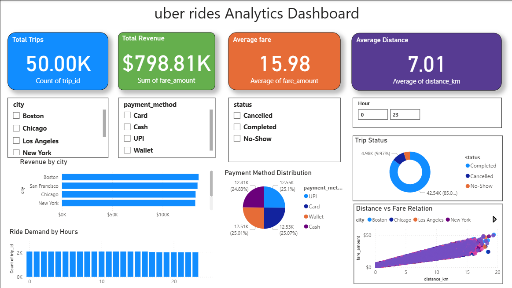

# Uber Ride Analytics Dashboard

## Overview

This project is a **data analytics dashboard built using Microsoft Power BI** to analyze ride-sharing trip data.
The dashboard provides insights into trip demand, revenue distribution, payment methods, and ride distance patterns.

It helps understand how ride-sharing services operate across different cities and how customer behavior affects revenue and demand.

---

## Dashboard Preview

---

## Key Insights

* Total Trips: **50K**
* Total Revenue: **$798K**
* Average Fare: **$15.98**
* Average Distance: **7.01 km**

The dashboard highlights:

* Revenue distribution across cities
* Ride demand by hour
* Payment method usage
* Relationship between trip distance and fare

---

## Features

* KPI cards for quick business metrics
* City-wise revenue analysis
* Hourly ride demand visualization
* Payment method distribution
* Distance vs Fare correlation analysis
* Interactive filters (City, Payment Method, Trip Status)

---

## Tools & Technologies

* Microsoft Power BI
* Data Visualization
* Data Analysis

---

## Dataset

The dataset contains ride-sharing trip details including:

* Trip ID
* City
* Distance (km)
* Fare Amount
* Payment Method
* Pickup Time
* Drop Time
* Trip Status

---

## Project Purpose

The goal of this project is to practice **data analysis and business intelligence skills** by building an interactive dashboard that transforms raw trip data into meaningful insights.

---

## Author

**Jishan Mansoori**
B.Tech Computer Science Student
Aspiring Data Scientist
